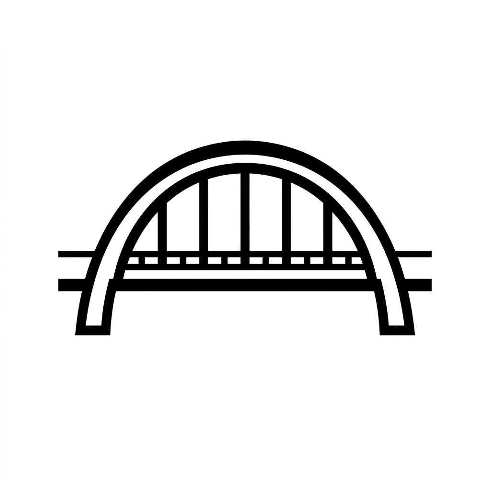

<p align="center">
  
</p>

<h1 align="center">Browser Bridge</h1>

<p align="center">
  <strong>Let AI agents and scripts control your local browser through a simple CLI — keeping your sessions, cookies, and credentials local.</strong>
</p>

<p align="center">
  <a href="#-quick-start">Quick Start</a> •
  <a href="#-features">Features</a> •
  <a href="#-architecture">Architecture</a> •
  <a href="#-install">Install</a> •
  <a href="./README_CN.md">中文</a>
</p>

<p align="center">
  
</p>

> **One-line pitch:** Browser Bridge connects a Chrome extension to a WebSocket relay, turning any LLM, script, or terminal command into a real-browser automation tool — while keeping your sessions, cookies, and credentials local.

---

## ✨ Features

- 🤖 **Agent-ready CLI** — LLMs and scripts call one command to drive the browser.
- 🔒 **Local session, cloud control** — reuse your logged-in browser; no cloud browser or cookie sync needed.
- 🌉 **WebSocket bridge** — CLI talks to a server, server talks to a local proxy, proxy talks to Chrome.
- 🧩 **Chrome Extension (MV3)** — built with Vite, loads as an unpacked extension.
- ⚡ **Bun + TypeScript** — fast startup, strict types, one package manager for the whole monorepo.
- 🧪 **Dev-friendly** — hot reload for server, proxy, and extension.

---

## 🚀 Quick Start

### 1. Install the CLI and extension

```bash
curl -fsSL https://github.com/dkisser/browser-bridge/releases/latest/download/install.sh | bash
```

Load `~/.browser-bridge/extension/` as an unpacked extension in Chrome, then run:

```bash
bridge up
```

### 2. Send your first command

```bash
bridge navigate https://github.com --browser <browser-id>
```

That’s it. The command travels from CLI → WebSocket server → local proxy → Chrome extension → browser.

> Use `bridge browser:list` to see the `<browser-id>` of your connected Chrome instance.

---

## 🏗️ Architecture

```
┌─────────────┐      ┌─────────────────┐      ┌─────────────────┐      ┌─────────────────┐
│  CLI / Agent │ ───▶ │  WebSocket      │ ───▶ │  Local Proxy    │ ───▶ │  Chrome         │
│             │      │  Server         │      │  (your machine) │      │  Extension      │
└─────────────┘      └─────────────────┘      └─────────────────┘      └─────────────────┘
                                                                              │
                                                                              ▼
                                                                       ┌─────────────┐
                                                                       │   Chrome    │
                                                                       │  (browser)  │
                                                                       └─────────────┘
```

| Layer | Component | Role |
|-------|-----------|------|
| Cloud / shared | CLI | Human or agent-facing command interface. |
| Cloud / shared | WebSocket Server | Routes commands to the right local proxy. |
| Local | Local Proxy | Maintains the outbound connection from your machine. |
| Local | Chrome Extension | Receives messages and executes browser actions. |

See [`docs/architecture-diagram.html`](./docs/architecture-diagram.html) for the full diagram.

---

## 📦 Install

### Option A: One-line installer (recommended)

```bash
curl -fsSL https://github.com/dkisser/browser-bridge/releases/latest/download/install.sh | bash
```

### Option B: Build from source (contributors only)

See the [Development](#-development) section below. You only need this if you are contributing to Browser Bridge.

---

## 🛠️ Development

> The steps below are for contributors/developers only. End users do not need to install `bun` or `git`.

```bash
# 1. Install dependencies
bun install

# 2. Start the WebSocket server
bun run dev:websocket

# 3. In another terminal, start the local proxy
bun run dev:local-proxy

# 4. In a third terminal, build the extension
bun run dev:extension

# 5. Load apps/extension/dist/ as an unpacked extension in Chrome

# 6. Run the CLI
bun run cli
```

---

## 📂 Project Structure

```
Browser-Bridge/
├── apps/
│   ├── cli/            # CLI entrypoint
│   ├── extension/      # Chrome Extension (Manifest V3, Vite)
│   ├── local-proxy/    # Local WebSocket proxy
│   └── websocket/      # WebSocket server, client, and protocol
├── packages/
│   └── shared/         # Shared constants and utilities
├── install/            # One-line installer scripts
└── docs/               # Architecture diagrams and guides
```

---

## 🧰 Tech Stack

- **Runtime & package manager**: [Bun](https://bun.sh)
- **Extension build**: Vite + Manifest V3
- **Transport**: WebSocket
- **Type checking**: TypeScript (strict)
- **Linting & formatting**: Biome
- **Testing**: Bun test runner + Bats for install scripts

---

## 🛡️ Security

- Only authenticated extensions can register with the WebSocket server.
- Commands are routed through the server; the local network is not exposed directly.
- The local proxy connects outbound to the server and extension, minimizing open ports.

---

## 🤝 Contributing

Contributions are welcome. Please open an issue first to discuss significant changes.

---

## 📄 License

[MIT](./LICENSE)
