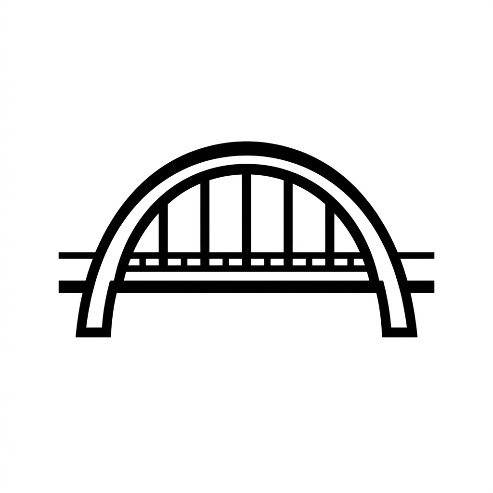

<p align="center">
  
</p>

<h1 align="center">Browser Bridge</h1>

<p align="center">
  <a href="#-quick-start">Quick Start</a> •
  <a href="#-features">Features</a> •
  <a href="#-use-via-cli">CLI</a> •
  <a href="#-use-via-mcp">MCP</a> •
  <a href="#-architecture">Architecture</a> •
  <a href="#-install">Install</a> •
  <a href="./README_CN.md">中文</a>
</p>

<p>
  <strong>Browser as a Tool for Any Agent: </strong>Let any AI agent, LLM, or script control your local browser.
  Use the included CLI, the Claude Code skill, or any integration that speaks the bridge protocol.
  Your sessions, cookies, and credentials stay local.
</p>


<p align="center">
  
  <br />
  <em>Browsing news with an agent</em>
</p>

<p align="center">
  
  <br />
  <em>Managing Gmail with an agent</em>
</p>

<p align="center">
  <strong>One-line pitch:</strong> Browser Bridge turns your local Chrome into a reusable tool for any agent.
  One browser, any LLM, script, or terminal command — while keeping your data local.
</p>

---

## ✨ Features

- 🤖 **Agent-ready interface** — one bridge protocol, consumed via CLI, Claude Code skill, or custom integration.
- 🔒 **Local session, cloud control** — reuse your logged-in browser; no cloud browser or cookie sync needed.
- 🌉 **WebSocket bridge** — agents talk to a server, server talks to a local proxy, proxy talks to Chrome.
- 🧩 **Chrome Extension (MV3)** — built with Vite, loads as an unpacked extension.
- ⚡ **Bun + TypeScript** — fast startup, strict types, one package manager for the whole monorepo.
- 🧪 **Dev-friendly** — hot reload for server, proxy, and extension.
- 🤖 **MCP server** — Streamable HTTP MCP server exposes browser tools to Claude Desktop, Cursor, and other MCP clients.

---

## 🚀 Quick Start

### 1. Install the bridge and extension

```bash
curl -fsSL https://github.com/dkisser/browser-bridge/releases/latest/download/install.sh | bash
```

Load `~/Browser-Bridge/extension/` as an unpacked extension in Chrome. The bridge services start automatically.

### 2. Send your first command

```bash
# List the connected Chrome instance
bridge browser:list

# Open a new tab and use its id for subsequent commands
bridge --browser <browser-id> tab:new https://github.com
bridge --browser <browser-id> --tab <tab-id> wait:navigation
```

That’s it. The command travels from CLI → WebSocket server → local proxy → Chrome extension → browser.

### 3. Use it from any agent

The `bridge` CLI is just one consumer of the bridge protocol. Browser Bridge ships with a ready-to-use Claude Code skill in [`./skills`](./skills/browser-bridge-user/SKILL.md), and anything that can open a WebSocket — for example, an MCP server you build, a custom SDK, or another agent framework — can send commands the same way.

For step-by-step usage, see [Use via CLI](#-use-via-cli) and [Use via MCP](#-use-via-mcp) below.

---

## 🖥️ Use via CLI

The `bridge` CLI controls a connected Chrome instance through the WebSocket server.

### Global options

```bash
bridge --browser <browser-id> [options] <command>
```

| Option | Description | Default |
|---|---|---|
| `--browser <id>` | Target browser instance (required for most commands) | — |
| `--tab <id>` | Target tab id (all page-level commands require this) | `0` |
| `--server <url>` | WebSocket server URL | `ws://localhost:3001` |
| `--timeout <ms>` | Command timeout | `10000` |
| `--json` | Output structured JSON instead of human-readable text | — |

### Common commands

```bash
# Service management
bridge up
bridge down
bridge status
bridge browser:list

# Tab management
bridge --browser <browser-id> tab:new https://github.com
bridge --browser <browser-id> tab:list
bridge --browser <browser-id> tab:switch <tab-id>
bridge --browser <browser-id> tab:close <tab-id>

# Navigation and interaction
bridge --browser <browser-id> --tab <tab-id> navigate https://github.com
bridge --browser <browser-id> --tab <tab-id> click "button.login"
bridge --browser <browser-id> --tab <tab-id> type "input#search" "browser bridge"
bridge --browser <browser-id> --tab <tab-id> gettext "h1"
bridge --browser <browser-id> --tab <tab-id> screenshot
```

### Example workflow

```bash
# 1. Start services and find a connected browser
bridge up
bridge browser:list

# 2. Open a tab and capture its id
bridge --browser <browser-id> tab:new https://news.ycombinator.com
# => {"tabId": 12345, ...}

# 3. Drive that tab explicitly
bridge --browser <browser-id> --tab 12345 gettext "a.title"
bridge --browser <browser-id> --tab 12345 click "a.title"
bridge --browser <browser-id> --tab 12345 wait:navigation
```

See `bridge --help` for the full command list.

---

## 🤖 Use via MCP

Browser Bridge exposes a [Streamable HTTP MCP server](docs/mcp-setup.md) alongside the WebSocket server. Once `bridge up` (or `bun run dev:websocket`) is running, add `http://localhost:3003/mcp` to any MCP client that supports Streamable HTTP.

### Start the MCP server

```bash
bridge up
```

The MCP endpoint is available at `http://localhost:3003/mcp`.

### Configure your MCP client

Any MCP client that supports Streamable HTTP can connect to Browser Bridge. Add the following server entry to your client's `mcpServers` configuration:

```json
{
  "mcpServers": {
    "browser-bridge": {
      "transport": "streamableHttp",
      "url": "http://localhost:3003/mcp"
    }
  }
}
```

Where to put this block depends on your client:

| Client | Configuration location |
|---|---|
| **Claude Desktop** | `claude_desktop_config.json` |
| **Claude Code** | project-level `.claude/mcp.json` or user-level `~/.claude/mcp.json` |
| **Cursor** | Cursor MCP settings, typically `.cursor/mcp.json` |
| **Codex (OpenAI)** | `~/.codex/config.json` under `mcpServers` |
| **Cline / Windsurf / others** | the client's own MCP server settings in the same JSON shape |

### Available tools

| Tool | Description |
|---|---|
| `list_browsers` | List connected browsers |
| `set_browser` | Pin a browser for this MCP session |
| `navigate`, `go_back`, `go_forward`, `refresh` | Navigation |
| `tab_list`, `tab_new`, `tab_close`, `tab_switch` | Tab management |
| `click`, `type`, `select`, `scroll`, `hover` | DOM interaction |
| `get_text`, `get_html`, `screenshot`, `pageinfo` | Data extraction |
| `wait_element`, `wait_navigation` | Waiting |

All browser-control tools accept an optional `timeout_ms` argument.

### Example workflow

```json
{
  "role": "user",
  "content": "Open a new tab to https://news.ycombinator.com, then get the text of the first story title."
}
```

The MCP agent will:

1. Call `list_browsers` and `set_browser` to pick a browser.
2. Call `tab_new` with `url` to open the page.
3. Call `get_text` with `selector: ".titleline > a"` to read the title.

See [docs/mcp-setup.md](docs/mcp-setup.md) for environment variables and the full tools list.

---

## 🏗️ Architecture

```
┌─────────────┐      ┌─────────────────┐      ┌─────────────────┐      ┌─────────────────┐
│  CLI / Agent │ ───▶ │  WebSocket      │ ───▶ │  Local Proxy    │ ───▶ │  Chrome         │
│             │      │  Server         │      │  (your machine) │      │  Extension      │
└─────────────┘      └─────────────────┘      └─────────────────┘      └─────────────────┘
                                                                              │
                                                                              ▼
                                                                       ┌─────────────┐
                                                                       │   Chrome    │
                                                                       │  (browser)  │
                                                                       └─────────────┘
```

| Layer | Component | Role |
|-------|-----------|------|
| Cloud / shared | Interfaces | Agent-facing entry points: CLI, Claude Code skill, or any custom integration. |
| Cloud / shared | WebSocket Server | Routes commands to the right local proxy. |
| Local | Local Proxy | Maintains the outbound connection from your machine. |
| Local | Chrome Extension | Receives messages and executes browser actions. |

See [`docs/architecture-diagram.html`](./docs/architecture-diagram.html) for the full diagram.

---

## 📦 Install

### Option A: One-line installer (recommended)

```bash
curl -fsSL https://github.com/dkisser/browser-bridge/releases/latest/download/install.sh | bash
```

The installer downloads the runtime, exposes `~/Browser-Bridge/extension/` as a symlink for Chrome, and starts the bridge services. You only need to load the unpacked extension in Chrome.

On macOS, the installer also enables login auto-start, so bridge services start automatically after you log in. To disable this, pass `--no-autostart` or run `bridge autostart off` later.

To reinstall the same version, pass `--force`. To install a specific version, set `BB_VERSION=vX.Y.Z`.

### Option B: One-line installer with Claude Code skill

If you already have [Claude Code](https://claude.ai/code), clone the repo and run the installer from the project root with `--with-skills` to install Browser Bridge plus the ready-to-use skill in `./skills`:

```bash
git clone https://github.com/dkisser/browser-bridge.git
cd browser-bridge
./install/install.sh --with-skills
```

Use `--skills-dir <path>` if you want to install skills somewhere other than `~/.claude/skills/`. Use `--no-skills` to explicitly skip skill installation.

By default, the curl installer does **not** install skills; use `--with-skills` when you want them.

### Option C: Build from source (contributors only)

See the [Development](#-development) section below. You only need this if you are contributing to Browser Bridge.

---

## 🛠️ Development

> The steps below are for contributors/developers only. End users do not need to install `bun` or `git`.

```bash
# 1. Install dependencies
bun install

# 2. Start the WebSocket server
bun run dev:websocket

# 3. In another terminal, start the local proxy
bun run dev:local-proxy

# 4. In a third terminal, build the extension
bun run dev:extension

# 5. Load apps/extension/dist/ as an unpacked extension in Chrome

# 6. Run the CLI
bun run cli
```

---

## 📂 Project Structure

```
Browser-Bridge/
├── apps/
│   ├── cli/            # CLI entrypoint (one bridge protocol consumer)
│   ├── extension/      # Chrome Extension (Manifest V3, Vite)
│   ├── local-proxy/    # Local WebSocket proxy
│   └── websocket/      # WebSocket server, client, and protocol
├── packages/
│   └── shared/         # Shared constants and utilities
├── install/            # One-line installer scripts
└── docs/               # Architecture diagrams and guides
```

---

## 🧰 Tech Stack

- **Runtime & package manager**: [Bun](https://bun.sh)
- **Extension build**: Vite + Manifest V3
- **Transport**: WebSocket
- **Type checking**: TypeScript (strict)
- **Linting & formatting**: Biome
- **Testing**: Bun test runner + Bats for install scripts

---

## 🛡️ Security

- Only authenticated extensions can register with the WebSocket server.
- Commands are routed through the server; the local network is not exposed directly.
- The local proxy connects outbound to the server and extension, minimizing open ports.

---

## 🤝 Contributing

Contributions are welcome. Please open an issue first to discuss significant changes.

---

## 📄 License

[MIT](./LICENSE)
