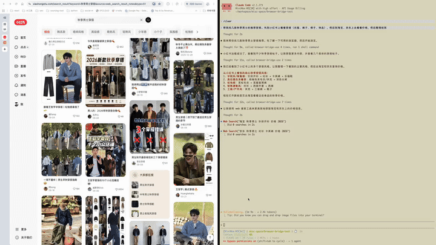
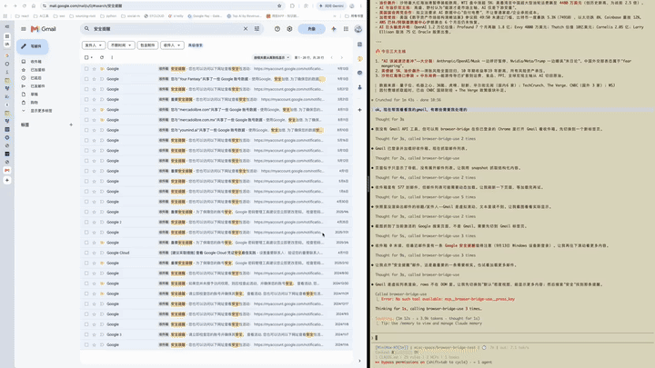

<p align="center">
  
</p>

<h1 align="center">Browser Bridge</h1>

<p align="center">
  <a href="#-功能特性">功能特性</a> •
  <a href="#-快速开始">快速开始</a> •
  <a href="#-安装">安装</a> •
  <a href="#-省-token-设计">省 token</a> •
  <a href="#-通过-cli-使用">CLI</a> •
  <a href="#-通过-mcp-使用">MCP</a> •
  <a href="#-架构">架构</a> •
  <a href="./README.md">English</a>
</p>

<p>
  <strong>让浏览器成为任意 Agent 的工具：</strong>让任何 AI Agent、LLM 或脚本控制你的本地浏览器。
  可以使用内置 CLI、Claude Code skill，或任何能使用 bridge 协议的集成。
  会话、Cookie 和凭证始终保留在本地。
</p>

<p align="center">
  
  <br />
  <em>穿搭推荐</em>
</p>

<p align="center">
  
  <br />
  <em>管理邮件</em>
</p>

<p align="center">
  <strong>一句话介绍：</strong>Browser Bridge 让你的本地 Chrome 成为任何 Agent 的可复用工具。
  一个浏览器，任意 LLM、脚本或终端命令——同时把你的数据保留在本地。
</p>

---

## ✨ 功能特性

- 🤖 **Agent 就绪的接口** —— 一个 bridge 协议，可通过 CLI、Claude Code skill 或自定义集成来消费。
- 🔒 **本地会话，本地控制** —— 复用你已登录的浏览器，无需云端浏览器或同步 Cookie。
- 🔗 **MCP server** —— Streamable HTTP MCP server，向 Claude Desktop、Cursor 等 MCP 客户端暴露浏览器控制工具。
- 🎯 **省 token 的读取** —— 观测先行的 snapshot、定向容器读取与硬上限，把页面噪声挡在 Agent 的上下文之外。

---

## 🚀 快速开始

### 1. 安装 bridge 与扩展

```bash
curl -fsSL https://github.com/dkisser/browser-bridge/releases/latest/download/install.sh | bash
```

在 Chrome 中加载 `~/Browser-Bridge/extension/` 作为解压扩展。bridge 服务会自动启动。

### 2. 发送第一条命令

```bash
# 查看已连接的 Chrome 实例
bridge browser:list

# 新建标签页，并在后续命令中使用返回的标签页 id
bridge --browser <browser-id> tab:new https://github.com
bridge --browser <browser-id> --tab <tab-id> wait:navigation
```

命令会经过 CLI → WebSocket 服务端 → 本地代理 → Chrome 扩展 → 浏览器。

### 3. 从任意 Agent 使用

`bridge` CLI 只是 bridge 协议的一种消费者。Browser Bridge 在 [`./skills`](./skills/browser-bridge-user/SKILL.md) 中内置了开箱即用的 Claude Code skill；任何能打开 WebSocket 的客户端——例如你自己构建的 MCP server、自定义 SDK 或其他 Agent 框架——都可以用同样的方式发送命令。

详细用法见下方的 [通过 CLI 使用](#-通过-cli-使用) 和 [通过 MCP 使用](#-通过-mcp-使用)。

---

## 📦 安装

### 方案 A：一行命令安装（推荐）

```bash
curl -fsSL https://github.com/dkisser/browser-bridge/releases/latest/download/install.sh | bash
```

安装脚本会下载运行时，在 `~/Browser-Bridge/extension/` 创建扩展的软连接，并自动启动 bridge 服务。你只需在 Chrome 中加载该解压扩展即可。

在 macOS 上，安装脚本还会默认开启登录自启动：一个 per-user LaunchAgent 以监督进程方式运行服务，登录后自动启动，崩溃后自动重启。如需关闭，可在安装时传入 `--no-autostart`，或之后运行 `bridge service disable`（再用 `bridge service enable` 打开）。

如需强制重装同一版本，可传入 `--force`；如需安装指定版本，可设置 `BB_VERSION=vX.Y.Z`。

### 方案 B：一行命令安装并附带 Claude Code skill

如果你已经在使用 [Claude Code](https://claude.ai/code)，先克隆仓库，然后在项目根目录运行安装脚本并传入 `--with-skills`，即可同时安装 Browser Bridge 和 `./skills` 目录下的 skill：

```bash
git clone https://github.com/dkisser/browser-bridge.git
cd browser-bridge
./install/install.sh --with-skills
```

如果你想把 skill 安装到 `~/.claude/skills/` 以外的目录，请使用 `--skills-dir <路径>` 指定。使用 `--no-skills` 可显式跳过 skill 安装。

curl 一键安装默认**不会**安装 skill；如需安装，请使用 `--with-skills`。

### 方案 C：从源码构建（仅贡献者）

普通用户无需执行。开发者请参考下方的 [🛠️ 开发](#-开发) 章节。

---

## 🎯 省 token 设计

模型按 token 付费，上下文窗口是固定预算——噪声是双份成本：自己占用一份，还会挤占会话后面真正需要的信号。Browser Bridge 把省 token 当作设计约束：信息在进入上下文之前就完成筛选。

三个手段由工具强制执行，而不是依赖模型当时的判断：

1. **观测先行**。`snapshot` 用 3K–8K 字符给出交互元素与标题的预算化结构视图，带稳定的 `@eN` 引用，让后续每次读取都有目标。
2. **定向读容器**。跟随 `@eN` 引用，或错误信息里给出的候选容器，只对装着信号的那一小块 `get_text`；渲染文本还会跳过隐藏子树和脚本样式。
3. **上限兜底**。超过十万字符的结果在进入上下文前就被拒绝，拒绝信息附带精确字符数——失败的 dump 本身也在教模型读得更窄。

2026-09-15 在登录态真实 Chrome 上实测（字符口径为 JS String.length）：

| 页面 | 整页 HTML | 任务所需信号 | 信噪比 | snapshot 成本 |
|---|---|---|---|---|
| 东财文章页 | 169,318 | 正文 2,318 | 1:73 | 8,154 |
| GitHub notifications | 303,176 | 通知列表 364 | 1:833 | 3,312 |
| Gmail 收件箱 | 324,078 | 邮件列表 546 | 1:594 | 2,982 |

三个页面的整页 HTML 全部超过十万字符上限，会在进入上下文前被拒——信号只占原始页面的 0.1%–1.4%。筛选本身是有损的，但页面始终活在浏览器里：被筛掉的内容随时可以用更细的粒度重读，或通过逃生舱拿原始 HTML。

完整原理——整页 dump 为什么必然失败、虚拟列表如何扭曲 DOM、两种反复出现的失败读取模式——见 [docs/saving-tokens.md](docs/saving-tokens.md)。

---

## 🖥️ 通过 CLI 使用

`bridge` CLI 通过 WebSocket 服务端控制已连接的 Chrome 实例。

### 全局选项

```bash
bridge --browser <browser-id> [options] <command>
```

| 选项 | 说明 | 默认值 |
|---|---|---|
| `--browser <id>` | 目标浏览器实例（大多数命令必需） | — |
| `--tab <id>` | 目标标签页 id（所有页面级命令必需） | `0` |
| `--server <url>` | WebSocket 服务端地址 | `ws://localhost:3001` |
| `--timeout <ms>` | 命令超时时间 | `10000` |
| `--json` | 输出结构化 JSON | — |

### 常用命令

```bash
# 服务管理
bridge service up
bridge service down
bridge service status
bridge browser:list

# 标签页管理
bridge --browser <browser-id> tab:new https://github.com
bridge --browser <browser-id> tab:list
bridge --browser <browser-id> tab:switch <tab-id>
bridge --browser <browser-id> tab:close <tab-id>

# 页面导航与交互
bridge --browser <browser-id> --tab <tab-id> navigate https://github.com
bridge --browser <browser-id> --tab <tab-id> click "button.login"
bridge --browser <browser-id> --tab <tab-id> type "input#search" "browser bridge"
bridge --browser <browser-id> --tab <tab-id> gettext "h1"
bridge --browser <browser-id> --tab <tab-id> snapshot
bridge --browser <browser-id> --tab <tab-id> screenshot
```

### 示例工作流

```bash
# 1. 启动服务并查看已连接的浏览器
bridge service up
bridge browser:list

# 2. 打开一个标签页并记录它的 id
bridge --browser <browser-id> tab:new https://news.ycombinator.com
# => {"tabId": 12345, ...}

# 3. 显式操作该标签页
bridge --browser <browser-id> --tab 12345 gettext "a.title"
bridge --browser <browser-id> --tab 12345 click "a.title"
bridge --browser <browser-id> --tab 12345 wait:navigation
```

完整命令列表请运行 `bridge --help` 查看。

---

## 🤖 通过 MCP 使用

Browser Bridge 在 `bridge-core` 进程内同时暴露了一个 [Streamable HTTP MCP server](docs/mcp-setup.md)（默认端口 3003）。启动 `bridge service up`（或 `bun run dev:core`）后，在任何支持 Streamable HTTP 的 MCP 客户端中添加 `http://localhost:3003/mcp` 即可。

### 启动 MCP server

```bash
bridge service up
```

MCP 端点地址为 `http://localhost:3003/mcp`。

### 配置 MCP 客户端

任何支持 Streamable HTTP 的 MCP 客户端都可以连接 Browser Bridge。在客户端的 `mcpServers` 配置中添加如下服务条目即可：

```json
{
  "mcpServers": {
    "browser-bridge": {
      "transport": "streamableHttp",
      "url": "http://localhost:3003/mcp"
    }
  }
}
```

具体写入哪个文件取决于你使用的客户端：

| 客户端 | 配置文件位置 |
|---|---|
| **Claude Desktop** | `claude_desktop_config.json` |
| **Claude Code** | 项目级 `.claude/mcp.json` 或用户级 `~/.claude/mcp.json` |
| **Cursor** | Cursor MCP 设置，通常为 `.cursor/mcp.json` |
| **Codex (OpenAI)** | `~/.codex/config.json` 中的 `mcpServers` |
| **Cline / Windsurf / 其他** | 各客户端自身的 MCP server 设置，JSON 结构相同 |


---

## 🏗️ 架构

```
┌─────────────┐                              ┌─────────────────┐
│  CLI / MCP   │ ───▶  bridge-core  ────▶  │  Chrome         │
│             │       （单进程：               │  Extension      │
└─────────────┘       3001 控制平面，          └─────────────────┘
                     3002 扩展，
                     3003 MCP）
```

| 层级 | 组件 | 职责 |
|------|------|------|
| 接入适配器 | CLI / MCP | 面向 Agent 的入口，都连接到 bridge-core，见 `CONTEXT.md`。 |
| 控制平面 | bridge-core | 单进程监听 3001（WebSocket）/ 3002（扩展）/ 3003（MCP）三个回环端口。 |
| 浏览器 | Chrome Extension | 接收消息并执行浏览器操作。 |

完整架构图见 [`docs/architecture-diagram.html`](./docs/architecture-diagram.html)。

---

## 🛠️ 开发

> 以下步骤仅适用于贡献者/开发者，终端用户无需安装 `bun` 或 `git`。

```bash
# 1. 安装依赖
bun install

# 2. 启动 bridge-core（CLI/WebSocket/MCP 控制平面 + 扩展桥接）
bun run dev:core

# 3. 另一个终端构建扩展
bun run dev:extension

# 4. 在 Chrome 中加载 apps/extension/dist/ 作为解压扩展

# 5. 运行 CLI
bun run cli
```

---

## 📂 项目结构

```
Browser-Bridge/
├── apps/
│   ├── bridge-core/    # 控制平面：CLI/MCP/extension 三端口单进程
│   ├── cli/            # CLI 入口（bridge 协议消费者之一）
│   └── extension/      # Chrome 扩展（Manifest V3，Vite）
├── packages/
│   └── shared/         # 共享常量与工具
├── install/            # 一键安装脚本
└── docs/               # 架构图与指南
```

---

## 🧰 技术栈

- **运行时与包管理**：<a href="https://bun.sh" target="_blank">Bun</a>
- **扩展构建**：Vite + Manifest V3
- **通信协议**：WebSocket
- **类型检查**：TypeScript（strict）
- **代码规范**：Biome
- **测试**：Bun test runner + Bats（安装脚本）

---

## 🛡️ 安全

Browser Bridge 驱动的是你日常已登录的浏览器，因此安全策略在动作的执行点——扩展内——强制执行，而不是在网络边界。

- **配对通道**：`bridge pair` 生成短时效配对码，在扩展弹窗中输入后换取 token，用于扩展与 bridge-core（3002）WebSocket 的相互认证（磁盘上只保存 token 的 SHA-256 哈希）。未配对的连接会被拒绝；网页无法调用 bridge-core 的 HTTP API——CORS 仅允许 `chrome-extension://` 来源。
- **仅监听回环**：本地代理、WebSocket 服务端和 MCP 端点都绑定 `127.0.0.1`；代理以出向方式连接服务端。非本地部署时 WebSocket 服务端支持 API key 认证（`BRIDGE_API_KEYS`）。
- **工作域策略**（见 `docs/adr/0006`-`0009`）：agent 只在其工作域内静默执行——它自己打开的标签页加上人批准的源。越界命令会立即以机器可读的原因码被拒绝（`origin_not_approved`、`approval_required` 等），并在扩展弹窗中弹出审批卡片；在弹窗中批准后重试即可。
- **硬拒绝**：浏览器系统页（`chrome://`、`chrome-extension://`、`file:`、`javascript:` 等）和内置黑名单（含 Chrome 网上应用店）一律拒绝且不可批准，agent 无法借此修改浏览器配置。
- **人工接管**：扩展弹窗中的接管开关开启期间，所有 agent 命令都会被拒绝，直到你释放。
- **敏感动作**：在密码或信用卡输入框中输入、以及表单提交（`type` 带 `submit`）永远需要一次性批准；agent 发起的下载会被暂停待你确认。

---

## 🤝 贡献

欢迎贡献。请先提交 issue 讨论重大变更。

---

## 📄 许可证

[MIT](./LICENSE)
